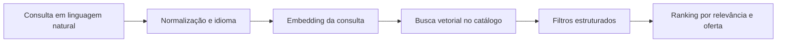
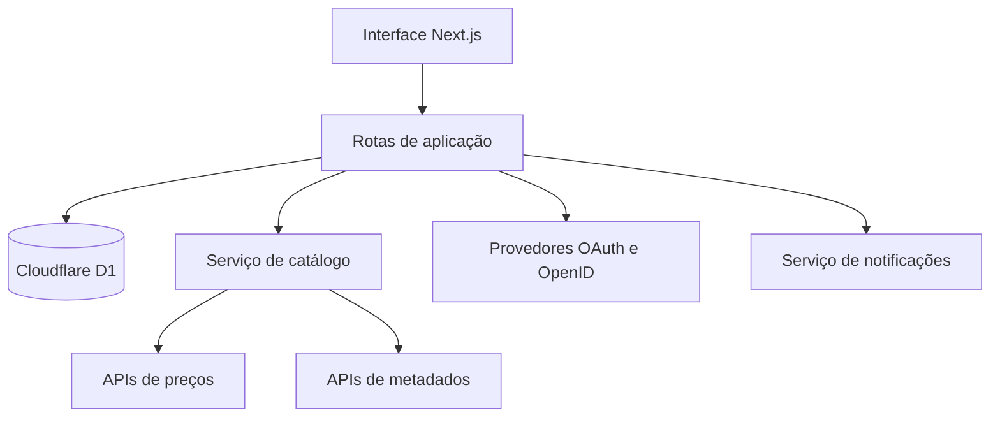

# DealRadar

> Uma plataforma inteligente para descobrir promoções, comparar preços e acompanhar jogos em lojas oficiais e revendedores autorizados.

[](#status-do-projeto)
[](https://nextjs.org/)
[](https://www.typescriptlang.org/)
[](https://developers.cloudflare.com/d1/)
[](#licença)

## Demonstração

Acesse a versão navegável:

### [dealradar.duduroque08.chatgpt.site](https://dealradar.duduroque08.chatgpt.site)

## Sobre o projeto

O **DealRadar** foi idealizado para reduzir o esforço necessário para encontrar um jogo pelo melhor preço possível. Em vez de visitar diferentes lojas, comparar moedas manualmente e acompanhar promoções isoladas, o usuário poderá pesquisar em linguagem natural, aplicar filtros objetivos e manter uma lista personalizada de jogos.

A proposta combina três pilares:

1. **Descoberta inteligente:** pesquisa por título, tema, gênero, engine, plataforma, ano e características descritas em linguagem natural.
2. **Comparação confiável:** preços provenientes somente de lojas oficiais ou revendedores autorizados, acompanhados de desconto, preço habitual e menor preço histórico.
3. **Acompanhamento pessoal:** favoritos, jogos de interesse, alertas de promoção, preferências regionais e integração opcional com contas de jogos.

## Principais funcionalidades

### Busca inteligente e semântica

- Pesquisa por nome do jogo ou descrição livre, como `jogos de terror psicológico` ou `RPG cooperativo em mundo aberto`.
- A intenção informada no texto tem prioridade sobre filtros definidos como `Todos`.
- Filtros opcionais refinam a busca sem substituir o significado do texto.
- Correspondência por gênero, tags, descrição, engine e plataformas.
- Ordenação por relevância, maior desconto, menor preço e melhor avaliação.

### Comparação de ofertas

- Preço atual e preço original.
- Percentual de desconto calculado automaticamente.
- Comparação com o menor preço histórico.
- Identificação da loja responsável pela oferta.
- Sinalização visual de loja verificada.
- Link externo para consultar ou adquirir o jogo no parceiro selecionado.

### Favoritos e interesses

- Adição e remoção de favoritos.
- Marcação independente de jogos de interesse.
- Selo de favorito nos resultados futuros.
- Radar de preço por jogo.
- Organização dos itens salvos no perfil do usuário.

### Perfil do jogador

- Resumo de favoritos e radares ativos.
- Lista pessoal de jogos acompanhados.
- Preferências de idioma e moeda.
- Visualização planejada de jogos mais jogados em contas vinculadas.
- Estimativa futura de economia obtida por meio das ofertas encontradas.

### Conta e segurança

- Estrutura de dados para perfil e preferências.
- Fluxos de interface para cadastro e login.
- Planejamento para autenticação com Google, Steam e Microsoft/Xbox.
- Tela para alteração de nome, e-mail e preferências.
- Opção de autenticação em duas etapas.
- Fluxo de exclusão de conta.
- Vínculo e desvínculo planejado de contas externas.

### Alertas

- Preferência para receber notificações de queda de preço.
- Acompanhamento de favoritos e jogos de interesse.
- Estrutura de banco de dados para preços-alvo e status do alerta.
- Envio por e-mail, push ou webhook planejado para a etapa de integração.

### Internacionalização

- Seleção de idioma no perfil.
- Seleção entre BRL, USD e EUR na demonstração.
- Formatação regional dos valores com `Intl.NumberFormat`.
- Arquitetura preparada para conversão por taxa de câmbio atualizada.

## Fontes de dados planejadas

O DealRadar não pretende utilizar marketplaces de procedência duvidosa nem vendedores de chaves sem verificação. A política do produto é trabalhar somente com fontes que ofereçam rastreabilidade e boa reputação.

| Finalidade | Fonte planejada | Utilização |
| --- | --- | --- |
| Preços e histórico | [IsThereAnyDeal API](https://docs.isthereanydeal.com/) | Melhor preço, histórico, bundles e lojas cobertas |
| Catálogo Steam | [Steam Web API](https://steamcommunity.com/dev) | Dados públicos, biblioteca autorizada e tempo de jogo |
| Login Steam | [Steam OpenID](https://steamcommunity.com/dev) | Identificação segura sem coletar senha Steam |
| Xbox e Microsoft Store | [Xbox Services](https://learn.microsoft.com/gaming/gdk/docs/services/fundamentals/xbox-services-api/live-introduction-to-xbox-live-apis) | Dados autorizados da conta e serviços Xbox |
| Metadados complementares | [IGDB API](https://api-docs.igdb.com/) | Gêneros, engines, datas, plataformas e capas |

As APIs exigem chaves, aprovação, limites de uso e respeito aos termos de cada provedor. Nenhuma credencial deve ser adicionada ao repositório.

## Como a busca funciona

Na versão atual, a busca utiliza um mecanismo local de intenção e correspondência textual:

1. Normaliza o texto informado pelo usuário.
2. Detecta conceitos conhecidos, como terror, RPG, mundo aberto e cooperativo.
3. Compara a intenção com título, gêneros, tags, descrição, engine e plataformas.
4. Aplica os filtros explícitos como refinamento.
5. Ordena os resultados segundo a preferência escolhida.

Para produção, a evolução planejada é utilizar embeddings e busca vetorial:



O ranking final poderá combinar similaridade semântica, qualidade da promoção, reputação da loja, avaliação do jogo, preferências do usuário e disponibilidade regional.

## Arquitetura



### Tecnologias atuais

- **Next.js 16** para componentes, rotas e renderização.
- **React 19** para estado e interações da interface.
- **TypeScript 5.9** para tipagem estática.
- **Vinext/Vite** para build compatível com Cloudflare Workers.
- **Cloudflare D1** como banco relacional serverless.
- **Drizzle ORM** para definição do esquema e migrações.
- **CSS responsivo** com design system próprio do DealRadar.

## Estrutura do banco de dados

O esquema inicial inclui três entidades:

### `profiles`

Armazena nome de exibição, moeda, idioma, preferência de alertas, status do 2FA e identificadores opcionais de contas externas.

### `saved_games`

Relaciona usuários a jogos salvos como `favorite` ou `interested`. A chave composta impede duplicação do mesmo estado para um jogo.

### `price_alerts`

Mantém jogo monitorado, preço-alvo opcional, estado do alerta e data de criação.

As migrações ficam em [`drizzle/`](./drizzle), e o esquema tipado está em [`db/schema.ts`](./db/schema.ts).

## Estrutura do projeto

```text
DealRadar/
├── app/
│   ├── api/profile/route.ts   # Perfil, preferências e jogos salvos
│   ├── globals.css            # Design system e responsividade
│   ├── layout.tsx             # Metadados e layout principal
│   └── page.tsx               # Experiência principal do produto
├── db/
│   ├── index.ts               # Conexão com Cloudflare D1
│   └── schema.ts              # Tabelas Drizzle
├── drizzle/                   # Migrações SQL
├── public/                    # Recursos estáticos
├── scripts/                   # Build e validação
├── tests/                     # Testes do artefato renderizado
├── drizzle.config.ts
├── package.json
└── README.md
```

## Executando localmente

### Pré-requisitos

- Node.js `22.13.0` ou superior.
- npm 10 ou superior.
- Ambiente Linux recomendado para os scripts auxiliares de build.

### Instalação

```bash
git clone https://github.com/Vanleef/DealRadar.git
cd DealRadar
npm install
```

### Desenvolvimento

```bash
npm run dev
```

### Validação

```bash
npm run lint
npm test
```

### Banco de dados

Depois de alterar `db/schema.ts`, gere uma nova migração:

```bash
npm run db:generate
```

## Variáveis de ambiente planejadas

As integrações externas ainda não estão ativadas. Quando forem implementadas, deverão utilizar variáveis semelhantes às abaixo:

```dotenv
ITAD_API_KEY=
IGDB_CLIENT_ID=
IGDB_CLIENT_SECRET=
STEAM_WEB_API_KEY=
GOOGLE_CLIENT_ID=
GOOGLE_CLIENT_SECRET=
MICROSOFT_CLIENT_ID=
MICROSOFT_CLIENT_SECRET=
EMAIL_PROVIDER_API_KEY=
EXCHANGE_RATE_API_KEY=
```

Crie um arquivo `.env.local` apenas no ambiente de desenvolvimento.

## Status do projeto

### Implementado

- [x] Identidade visual e interface responsiva.
- [x] Busca textual com interpretação local de intenção.
- [x] Filtros por gênero, plataforma, engine e preço.
- [x] Ordenação de resultados.
- [x] Cards com preço, desconto e menor histórico.
- [x] Tela detalhada do jogo.
- [x] Estados interativos de favorito e interesse.
- [x] Perfil, biblioteca e configurações demonstrativas.
- [x] Seleção de moeda, idioma, alertas e tema.
- [x] Esquema D1 para perfis, jogos salvos e alertas.
- [x] Rota protegida para leitura e atualização do perfil.
- [x] Build e implantação da demonstração.

### Em desenvolvimento

- [ ] Sincronização da interface com o banco D1 para todos os estados pessoais.
- [ ] Catálogo e preços reais via IsThereAnyDeal.
- [ ] Metadados completos e capas via provedor licenciado.
- [ ] Cadastro público e autenticação por e-mail.
- [ ] Login com Google.
- [ ] Login e biblioteca Steam.
- [ ] Login e dados autorizados do Xbox.
- [ ] 2FA funcional.
- [ ] Alertas reais por e-mail e push.
- [ ] Conversão monetária com câmbio atualizado.
- [ ] Internacionalização completa da interface.
- [ ] Busca vetorial e recomendações personalizadas.

## Roadmap

| Fase | Entrega | Resultado esperado |
| --- | --- | --- |
| 1 | Catálogo real e API de preços | Ofertas atualizadas e histórico confiável |
| 2 | Autenticação e persistência | Contas, favoritos e preferências permanentes |
| 3 | Alertas e jobs programados | Notificação automática de promoções |
| 4 | Steam e Xbox | Biblioteca e recomendações personalizadas |
| 5 | Busca semântica | Consultas naturais e ranking inteligente |
| 6 | Observabilidade e testes | Produto estável, mensurável e auditável |

## Contribuição

O projeto está em evolução. Antes de contribuir:

1. Abra uma issue descrevendo a proposta ou o problema.
2. Crie uma branch a partir de `main`.
3. Mantenha alterações pequenas e bem documentadas.
4. Execute lint e testes antes de enviar a contribuição.
5. Abra um pull request explicando impacto e validação.

## Autor

Desenvolvido por **Eduardo Santos**.

- GitHub: [@Vanleef](https://github.com/Vanleef)
- Portfólio: [eduardo-santos-portfolio](https://vanleef.github.io/eduardo-santos-portfolio/)

## Licença

Este repositório ainda não possui uma licença definida. Até que uma licença seja adicionada, todos os direitos sobre o código, a identidade visual e o conteúdo permanecem reservados ao autor.

---

<p align="center">
  <strong>DealRadar</strong><br />
  Encontre o jogo certo. No momento certo. Pelo melhor preço.
</p>
